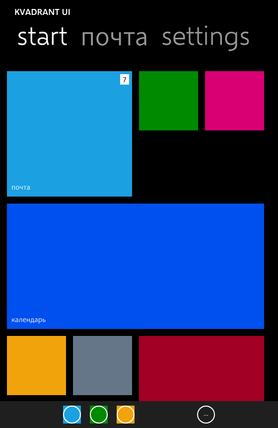
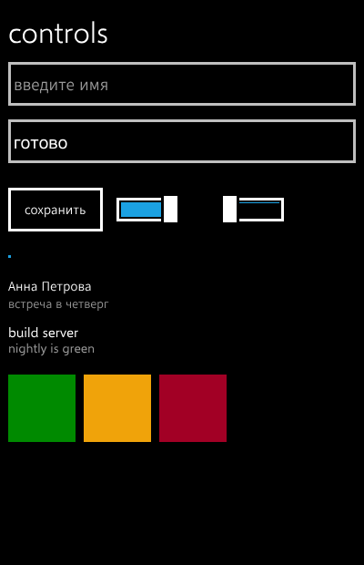
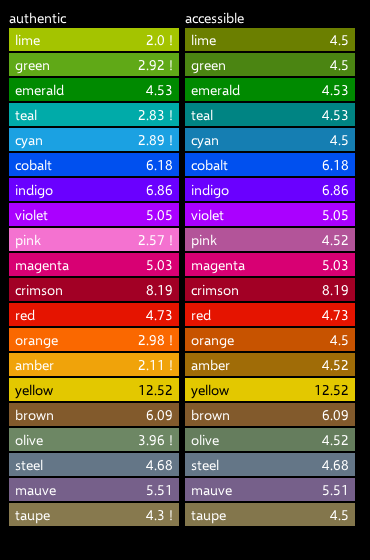
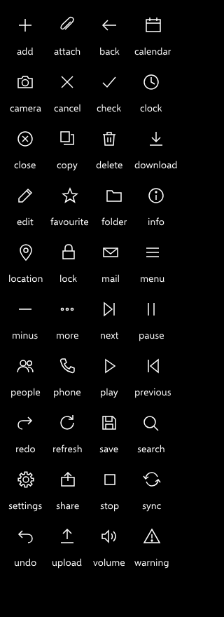

# Kvadrant UI

A component library for **Compose Multiplatform** in the Metro design language — Windows Phone 8 and
Windows 8 — with an optional adapter that lets it sit beside `androidx.compose.material3`.

<p align="center">
  
  
  
  
</p>

<sup>Those four pictures are **the golden images `./gradlew check` compares against**, not marketing
renders. They live in the screenshot suite, so a component that changes appearance either changes
this README or fails the build — a README cannot show a version of this library that no longer
exists.</sup>

**[Press the components →](https://youndie.github.io/kvadrant-ui/)** Every one of them runs on that
page, compiled to WebAssembly from these sources, in both palettes at once — beside
[the sample application](https://youndie.github.io/kvadrant-ui/demo.html), which is the same screen
`:sample:run` opens on the desktop, and
[the API reference](https://youndie.github.io/kvadrant-ui/api/index.html) generated from the same
KDoc that says where each number came from.

Fifty-one public composables: the tilt every surface inherits, the Pivot and the Panorama, the
Start-screen tiles including the live ones, ten base controls, the pickers, the application bar, the
page transitions, and forty drawn icons. Colours, type ramp, tile metrics and motion curves are
generated from a vendored dump of Microsoft's own theme resources rather than typed in.

## What makes this not a Metro-coloured Material application

**Every number comes from a document, and the document is named.** The Windows Phone SDK's
design-time `System.Windows.xaml` settled a series of things that looking at screenshots had got
wrong: that a text box is a *light* field in both themes, that focusing it does not bring in the
accent, that a button's visible border sits inside twelve pixels of invisible touch target. Where no
public source exists — eight metrics, the Pivot's among them — the KDoc says so and the number ships
as a parameter rather than a constant, so a caller who knows better can say so.

**The light theme is not an inversion of the dark one.** Both are transcribed; neither is derived.
The site shows each component in both at once, which is the quickest way to see the difference.

**Anything better than the phone is behind a flag.** `KvadrantTheme(remastered = true)` is off by
default, and every deviation it enables is a row in the research document saying what it replaces.
With it off, a component that looks *nicer* than Windows Phone is a defect. That is what keeps the
fidelity claim falsifiable — otherwise you could no longer tell a faithful component from a pleasant
one by looking. Restoring behaviour the original had is not a deviation and is not gated.

**No Segoe asset is in this repository**, test fixtures included. Selawik is Microsoft's own
metric-compatible stand-in and is the reason a typeface can ship here at all; it has no Cyrillic, so
Source Sans 3 is bundled as the companion and `KvadrantText` routes per character.

## Using it

```kotlin
repositories {
    maven("https://reposilite.kotlin.website/snapshots") {
        // Filtered, like every third-party repository should be: an unfiltered one takes part in
        // resolving everything, and the day its host is unreachable Gradle fails artefacts that
        // live elsewhere.
        mavenContent { includeGroupAndSubgroups("io.github.youndie") }
    }
}

dependencies {
    implementation("io.github.youndie:kvadrant-core:0.2.0")
    // Only if the application also uses Material 3.
    implementation("io.github.youndie:kvadrant-material-adapter:0.2.0")
}
```

```kotlin
KvadrantTheme(
    colors = KvadrantColors.dark(),
    typography = KvadrantTypography.default(kvadrantLatin()),
) {
    KvadrantPage(applicationTitle = "KVADRANT UI", pageTitle = "inbox") {
        KvadrantListItem("Anna Peterson", subtitle = "meeting on Thursday", onClick = {})
        KvadrantButton("reply", onClick = {})
    }
}
```

The press feedback is the theme's, not the call site's: `KvadrantTheme` replaces `LocalIndication`
with the tilt, so anything clickable underneath it leans towards the finger without being asked to.

## Status, honestly

**`0.2.0`, and the minor moved because two signatures did.** `KvadrantColors` gained a parameter
and `KvadrantMetrics` gained five, so a consumer compiled against `0.1.0` does not link against this
one — which is the case the paragraph below already names, and a patch number would have hidden it.

**`0.1.0` was the first version of this that exists anywhere.** Nothing had been published
before it — not even a snapshot, which was checked rather than assumed: `io/github/youndie/kvadrant-core`
was absent from both trees on the host, so the install snippet above had never resolved for anybody.

This section used to state the opposite rule — that the version stays a snapshot "until the API has
been used by somebody other than its author" — and the rule was traded away on purpose, because a
snapshot nobody can find is not how an API gets used. What it costs is that the number is spent: a
published coordinate cannot be renamed, only deprecated, so an API that turns out wrong is a `0.2.0`
and not an edit. See [B-46](docs/backlog/B-46-the-first-release.md).

| | |
|---|---|
| Desktop (JVM) | Built and tested. The screenshot suite runs here and nowhere else. |
| Android | Built. **A green `check` says nothing about it** — viddik's capture engine is JVM-only, so its guard is a number instead: `:kvadrant-core:connectedAndroidDeviceTest` solves the tilt's camera out of a trapezoid rendered on a real device. It needs a phone and is not in `check`. |
| wasm | Built, and the documentation site is what runs on it. `wasmJsBrowserTest` is *skipped*, which in a green build reads exactly like a pass. |
| iOS | Built, and **the only target whose check is inside the gate**: `IosFontStackTest` runs on a simulator Gradle boots, so it needs neither hardware nor somebody remembering. **The core only** — the Material adapter has no iOS variant. There are no goldens — viddik's capture engine is JVM-only — and the demo runs through [`scripts/ios-sample-app.sh`](scripts/ios-sample-app.sh). |

Two known defects, both open and both written down: the screenshot suite renders Cyrillic
differently under FreeType than under macOS ([B-35](docs/backlog/B-35-cyrillic-renders-differently-on-linux.md)),
and the tilt gives each surface its own camera where the phone had one for the screen
([B-26](docs/backlog/B-26-per-layer-camera-versus-a-global-one.md)).

## The documentation

Written for whoever picks up a task next, agent or otherwise, and read in this order:

1. **[docs/research/research-architecture.md](docs/research/research-architecture.md)** — what was
   verified and against what, which decisions were taken and what each of them rejected, which risks
   are open. A task read without it looks like "do the obvious thing", and here the obvious thing is
   usually the one that was rejected for a reason.
2. **[backlog.md](backlog.md)** — the order of work and why it is that order.
3. **[docs/components.md](docs/components.md)** — the catalogue: every public composable, where it
   is, and which preview shows it. Generated, and `make check` fails when it is stale.

## Building

```bash
export JAVA_HOME=$(/usr/libexec/java_home -v 25)
./gradlew check          # tests, ktlint, the screenshot suite, the ABI dump, the generators
make check               # the documentation tree and the catalogue
./gradlew :sample:run    # the demo on the desktop
make site                # the site, the demo and the API reference into build/site
```

One gate each, and nothing outside them. `./gradlew ktlintFormat` runs on the mac — a formatter's
edits do not survive being made anywhere else.

## Licence

Apache-2.0 for the code — [LICENSE](LICENSE).

**The bundled fonts are not under it.** Selawik and Source Sans 3 are SIL OFL 1.1, and the full text
of each ships in the artefact as `Selawik-OFL.txt` and `SourceSans3-OFL.txt`; the published POM
declares both licences with a note saying which covers what, because licence tooling reads a POM and
not a jar.
